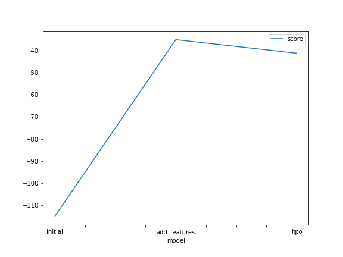
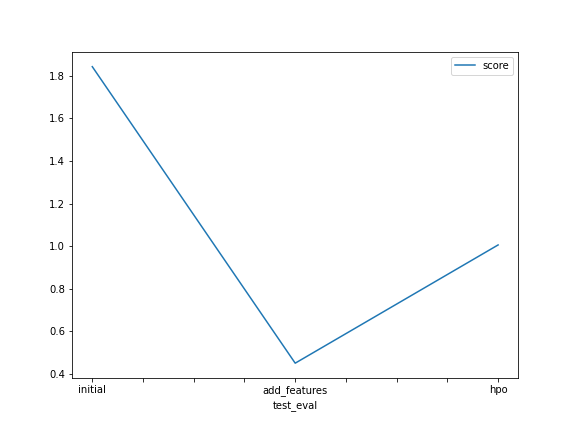

# Report: Predict Bike Sharing Demand with AutoGluon Solution
#### Sheetal

## Initial Training
### What did you realize when you tried to submit your predictions? What changes were needed to the output of the predictor to submit your results?
I had issues with my local environment. I had to uninstall and reinstall the packages first and foremostly. In the beginning I got scores in the range 1 and later after hyperparameter tuning I had score 1.0005

### What was the top ranked model that performed?
The one with tabular autogluon hyperparameter tuning method that scored 1.005

## Exploratory data analysis and feature creation
### What did the exploratory analysis find and how did you add additional features?
The season and weather distribution are similar. The temperature is normally distributed. From the tain and test dataset at the beginning, the datetime column was split and new features were created like year, hour, month and day features. These new features improved the model 

### How much better did your model preform after adding additional features and why do you think that is?
TODO: Add your explanation

## Hyper parameter tuning
### How much better did your model preform after trying different hyper parameters?
The first raw submission had 1.84164 score, then with new features 0.45166 and then with tabular autogluon got score of 1.00570. The additional parameter tuning part after the autogluon is not that clear to me.

### If you were given more time with this dataset, where do you think you would spend more time?
I would concerntrate to work on the features to  improve the model's performance or use one hot encoding technique as the categorical features are less in numbers. May be work with the working hours feature as we similary have working days.

### Create a table with the models you ran, the hyperparameters modified, and the kaggle score.

|model|timelimit|presets|hp-method|score|
|0|initial |600|best quality|none|1.84164
|1|add_features |600|best quality|regression|0.45129
|1|hpo |600|best quality|tabular autogluon|1.00570
### Create a line plot showing the top model score for the three (or more) training runs during the project.

TODO: Replace the image below with your own.

### Create a line plot showing the top kaggle score for the three (or more) prediction submissions during the project.

TODO: Replace the image below with your own.

## Summary
To summarize the experience I got more insights of Exploratory Data Analysis and hyperparameter tuning with Autogluon
